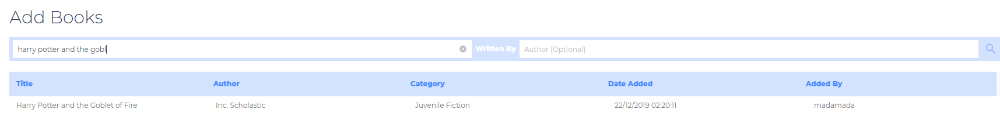

# 1. Video demonstration


# 2. Purpose of the readme

The readme serves the following purpose

1. Describe the features developed by team LionDB. This covers the following
   - Base features (Mandatory as per the project description)
   - Extra features (Cool stuff that we implemented to extended the interesting stuff that was taught in class. Learning never stops, no free lunch!)
2. Explain how the features were developed
   - High level sequential diagrams 
   - Low level code descriptions
   - Where to find the codes in the repositories
3. Emphasize the good and clean coding practices used as encouraged by Prof.

# 3. Pre-requisites

To run the scripts please have the following installed 

- Python version XXX (TO BE FILLED)

Also prepare your AWS credentials

# 4. Launching the set-up scripts (Instructions)

 (TO BE FILLED)


# 5. Automation

## 5.1 High level diagram

We had to set-up the databases first because the database URLs are used for the analytics server (as we decided to ETL from the databases), the production backend (Where we have features like searching and adding books). Following that, we start up the analytics server which has its own Flask component. We also setup the production server's flask. Finally, each of these have their endpoints passed to React which can then query the relevant data that is needed for the frontend.


## 5.2 Some nuances

(TO BE FILLED)


# 6. Base features (Project requirements)

## 6.1 Frontend requirements

The following features were required by the project description (For each of them we have extended it, explained here and also elaborated on in the later sections under extra features)

- See some reviews
- Add a new review
- Add a new book

### 6.1.1 Viewing reviews

Code for the backend can be found in `book_review.py`

When we first enter the home page we see that there are 2 carousels of random picks and top rated picks. Users can select any book from there to view specific details for a book


When they click on a particular book they can see the reviews by clicking on the reviews tab. In addition, they can see the tags for the book, the number of faves (We have a favourites feature - check out section 7.1.4), the summary (if it exists) and the reviews (Purpose of this section)


Clicking the `read more` option shows the full review


### 6.1.2 Adding reviews

Code for the backend can be found in `book_review.py`

For the adding reviews, it continues on the same page as section 6.1.1. We can scroll down to see the adding feature option. Our team decided to only allow adding pages for users who have signed in. Hence, the screenshot below shows the prompt for users who have not signed in


After signing in, the page changes to show that users can leave reviews

 

We will now add a review


Upon clicking submit, we can see the latest review at the top


A cool feature that we added in to extend this is to view all past requests that a user has made. They can click on the "My Books" tab and then choose "My Reviews"


### 6.1.3 Adding new books


The adding books feature is an interesting feature that we added because it only allows users to add real books. We do this by using the Google Books API. We fetch 3 books from the Google API, and we prompt the user to select one of these books that were looked up. When they select a book, the Google API actually provides full information about a book such as the asin number and the title. This ensures that only valid books are added into the database. The high level diagram is shown above while the screenshots of the process are shown below. The code can be found in `book_add.py`

Upon clicking for the page we see a table of all the books that have been added


We can search for a book like "Harry Potter and the Gobl"


We can see that the new book has been added in 



## 6.2 Backend requirements

### 6.2.1 Deploying MongoDB


### 6.2.2 Deploying MySQL


### 6.2.3 Deploying the flask application


### 6.2.4 Logging

To log the API calls, we used Python's inbuilt logger to register that there has been an API call. We create a class for the specific logger handler that points to the **<u>Mongo collection</u>** for end points and writes to it for each API call. The code for the logger handler initialization can be found in `__init__.py` while the logging class code can be found in `logging_db.py`. We call the logger before each API call by specifying the `@app.before_request` decorator.

For this project, we retrieved the API parameters by connecting to the `request` object as well as the `record` parameters. With this, we could extract the following

- session_id: Based on the X-client-ID that is used to identify unique users whether they had accounts or not
- user_id: Extracted from the JWT token (Identify specific users that are registered in the database)
- raw: The original request
- ip: Extract the IP from the API record
- end_point: Extract the end point from the API record
- request_type: Extract the request type from the API record
- status: Extract the status from the API record
- time: Generated on the fly
- body: Extract the body from the API record

Subsequently, we then a separate class, found in `log_retrievals.py` that was responsible for fetching the data from MongoDB to be displayed on the frontend. In the screenshot shown below we have searched for a particular sessionID which shows a particular user's behavior on the site and every API call made. 


A cool feature is that we can filter by other fields. By clicking the dropdown we can identify all requests for a specific endpoint. In the example below, we select `Request Type` and choose the `GET` request


## 6.3 Analytics requirements


### 6.3.1 Creating HDFS across instances

An HDFS + Spark cluster is set up using a boto3 setup script, which uploads a bash setup script to each node to:

1. Update the system
2. Install Java 8 JRE
3. Download the Hadoop tarball, extracts it, move the extracted folder to /opt/hadoop
4. Configure HDFS in hadoop-env.sh, core-site.xml, hdfs-site.xml
5. Create a systemd unit file and enable the HDFS node as a systemd service

An additional bash setup script for the namenode, which formats the HDFS before it can be used.

### 6.3.2 Setting up the Spark cluster

An HDFS + Spark cluster is set up using a boto3 setup script, which uploads a bash setup script to each node to:

1. Update the system
2. Install Java 8 JRE, PySpark, and NumPy
3. Download the Spark tarball, extracts it, move the extracted folder to /opt/spark 
4. Configure Spark in spark-env.sh, spark-defaults.conf
5. Create a systemd unit file and enable the Spark node as a systemd service

An additional bash setup script for the namenode (i.e. master node), which installs extra packages and a Flask-based control server to expose Spark functions the frontend.

### 6.3.3 Transferring the Pearson and tfidf scripts

- The Pearson and TFIDF scripts are loaded into the namenode (i.e. master node) by the setup scripts as part of the control server.
- The scripts are submitted by the control server using spark-submit when a job request is received.

### 6.3.4 ETL pipeline - Loading from production database

Since the Pearson computation requires the reviewText (Present in the MySql database) and the prices of the books (present in the MongoDB), we needed an efficient pipeline to get data from the 2 databases. The tfidf was a sub-problem of this which only required the MySql data. For this project, we saved the data into HDFS and as an extension, also write an additional Flask script to read the data and sent it to the front end. This means that we do not need to access the HDFS to see the data which mimics an actual production system where users of the web platform should not be able to access backend file systems. The diagram for the pipeline is as shown below.


Although we mentioned that data is rendered via backend call, for grading purposes, the files can be found in the HDFS by going through the following steps (TO BE FILLED)

1. ssh into the name node
2. Enter the following path 

To speed up the scripts, we realized that we did not need all the fields in the MySQL and MongoDB. As such, by pre-specifying the fields we needed, we significantly reduced loading time!

### 6.3.5 Pearson coefficient

**<u>Description</u>**

This section describes the calculation of the Pearson correlation. The code can be found in `analytics/control-server/pearson.py`

**<u>Explanation</u>**

We were tasked to compute the correlation in map reduce fashion.

The first challenge was loading the data in from MySQL and Mongo as the prices and the reviews were stored separately. This is explained in the ETL pipeline section above. With the data in HDFS, we can safely read the data.

Since we want to find the relationship between review length against the price, we first need to get the review length. There could be multiple reviews for a specific book (asin). Hence, we do a `groupby` asin operation, an and then an aggregation where we get the average length of a review for a specific review.

Once we have processed all the data, we do a `join` on asin. We can then continue with the real Pearson Coefficient computations 

We chose the standard map reduce commands as they are considered to be narrow dependencies which ensures that each computation can be parallelized. These operations comes from the Pearson formula which can be found at this page https://en.wikipedia.org/wiki/Pearson_correlation_coefficient


For each pairs of mathematical operations below, we perform a map and reduce operation

1. Compute $\sum x_{i}y_{i}$
2. Compute $\sum x_{i}$
3. Compute $\sum y_{i}$
4. Compute $\sum x_{i}^{2}$
5. Compute $\sum y_{i}^{2}$

Previously we also added in computations for the means of x and y as there were different variations of the Pearson correlation

Once we have the base mathematical operations, we substituted into the equation to compute the Pearson correlation. 

The number is output to the console which is read the backend script and then rendered on the frontend. Hence, please access the results page on the frontend to see the correlation value generated. We have also provided the result in the report (below)

**<u>Results</u>**

Upon running the Pearson code, we get the following result

```
pearson correlation >>>0.03771094888383284
```

as an extension, we also saved the average review length and the price as we want to display it on a table in the frontend in addition to the Pearson correlation for a much richer user experience.

### 6.3.6 tfidf result

**<u>Description</u>**

This section describes the calculation of the TFIDF. The code can be found in `analytics/control-server/basic_tfidf.py`

**<u>Explanation</u>**

In terms of ETL, the tfidf task is slightly easier as we do not need to fetch any data from Mongo. We just need to run sqoop on MySQL. 

One of the first pre processing tasks needed is to fill the empty reviews with an empty string, doing this prevents errors from coming up later.

We then vecorized the review tests such that we have an index associated with each word. From here, we can fit it into the ml lib library where the tfidf scores can be computed. We then want to convert the indexes back to words so that the tfidf weights can be more easily associated to the exact words that produced them.

**<u>Results</u>**

Upon running the tfidf code, we get the following result (Truncated), The screenshot below shows the result on a subsample of the dataset. For the full result, please view it on the frontend (This result looks slightly different because we are running on less samples just to display the structure of the data). The result contains the following columns

- reviewText: Original review text from mySql
- features_indices_size: Number of features for a particular reviewText (Number of words that are identified to have tfidf weights)
- features_indices: The index of the word in the sentence that has its corresponding feature weight value (tfidf value)
- features_indices_words: Converts the index to the words for more intuitive understanding 
- feature_values: The weight associated to each word (index 0 will map to the first word of the feature_indices_words column)

```
'''
+--------------------+--------------------+--------------------+---------------------+--------------------+
|          reviewText|feature_indices_size|     feature_indices|feature_indices_words|      feature_values|
+--------------------+--------------------+--------------------+---------------------+--------------------+
|I enjoy vintage b...|                  34|[0, 1, 2, 3, 4, 7...| [the, and, a, to,...|[0.7702577, 0.529...|
|This book is a re...|                  38|[0, 1, 2, 3, 4, 5...| [the, and, a, to,...|[0.5776933, 0.529...|
|This was a fairly...|                  34|[0, 1, 2, 3, 4, 5...| [the, and, a, to,...|[0.5776933, 0.794...|
|I'd never read an...|                  15|[0, 4, 5, 9, 23, ...| [the, I, of, this...|[0.19256443, 0.33...|
|If you like perio...|                  14|[0, 5, 9, 18, 37,...| [the, of, this, y...|[0.19256443, 0.45...|
|A beautiful in-de...|                  19|[0, 2, 5, 6, 11, ...| [the, a, of, is, ...|[0.19256443, 0.56...|
|I enjoyed this on...|                  24|[0, 1, 4, 7, 8, 9...| [the, and, I, in,...|[0.19256443, 0.26...|
'''

```

The full result can be found in `hdfs://<some_ip_of_name_node>:9000/reviews_tfidf.json'`

# 7. Bonus features

## 7.1 Viewable features

### 7.1.1 Normal users  (no account)

For users with no accounts, they will be limited to book searches, genre searches and are able to view reviews. If they want to view more features, they will be prompted to create accounts and login.

### 7.1.2 Admin users

Users with accounts have elevated privileges. To authenticate users, we employ a digital signature algorithm  involving the JWT token. 


For the database component of this, users have to first create an account. We set the column to be unique to ensure that users cannot create accounts with the same username and email. We do this by setting the sql column to `unique=True`. The codes can be found in `auth.py` and `models.py`

Upon creation of an account or logging in, we create a JWT token which has an expiry. For development purposes we set this to 10 days.

We also have a built in mechanism to handle user log outs and expired tokens. We create a table for revoked_tokens. Upon logging out or token expiry, the token will be added in as a row into the  `RevokedTokenModel` table.

### 7.1.3 Add books

Enhancement from the base project requirement. 

The adding books feature is an interesting feature that we added because it only allows users to add real books. We do this by using the Google Books API. We fetch 3 books from the Google API, and we prompt the user to select one of these books that were looked up. When they select a book, the Google API actually provides full information about a book such as the asin number and the title. This ensures that only valid books are added into the database. Ehancement and screenshots of the feature is already added Section 6.1.3

### 7.1.4 Favorite books

Code for this section can be found in `book-favourite.py`

For each book in the frontend, we can see the number of people who have favorited it 


When we Fave a book we can see the counts change 


Users can then go to the My Books tab and see all the Faves they have made


### 7.1.5 View other's  profiles

We can see all the reviews and faves by a particular user. By clicking on the name we can see all the books reviewed.


### 7.1.6 Genre Search

When we click on the Genre tab we can see all the Genres available for the user to select. The backend code for this feature can be found in `book_genre.py`. 


Subsequently, users can select a genre and this searches for all the corresponding books. For this example, we choose "Cooking by ingredients" which brings up all relevant books


### 7.1.7 Autocomplete for book searching 

Lastly, we stretched our learning for database queries by trying an autocomplete feature where we can search for a book based on any sub string within the original substring regardless of casing or even spelling (yes, it auto accounts for spelling mistakes). The code can be found `book_search.py` where the magic is done with the following query

```python
book_data = list(books.find({"$or": [{"$text": {"$search": prefix}}, {"title": regx}]},
                               {"asin": 1, "title": 1, "imUrl": 1}, limit=limit))
```

A screenshot of how it works is shown below 


## 7.2 Clean coding and good practices

### 7.2.1 Auto documentation with Swagger

For this project we knew that we would be stretching ourselves to implement many more APIs than the base requirements. Hence, we decided to code Flask in a way that allows auto documentation. When we were developing locally, we could easily hit the endpoint `http://localhost:5000/docs/` where we can see the various APIs. The screenshot below shows all the big meta categories of APIs


Within each category we can see the individual APIs


This is especially useful for the frontend as we can even test the APIs! For example, the screenshot below shows the response when we search for the book "Harry Potter and the Gob" (not even the full name of the book). It accurately fetches the correct full title of the book and its associated information. It provides the JSON response that the front end can then use.


### 7.2.2 Flask blueprints (Files for specific functions)

We split up our backend files according to the functions that they perform instead of combining them into a single `__init__.py file`. This makes it easier for different developers in the team to find the files with the functions for the use cases that they require.


### 7.2.3 Flask unit testing 

We attempted the TDD framework at a smaller scale to experiment with the process. This enables us to test our API calls against a ground truth. The screenshot of the test cases can be seen below. The test cases can be found in (TO BE FILLED)


## 7.3 Performance optimization

(TO BE FILLED)


## 7.4 Architecture decisions

We decided to split the frontend and backend for the application. We used React for the frontend and Flask for the backend. We did this so that we could parallelize the work between both applications. We planned the expected JSON schema such that the frontend team could continue working with data without having to wait for the backend team to deploy the application. This was the initial workflow till we enhanced it by adding Swagger documentation.


## 7.5 Convenient features for development

For initial development we wanted a way to prevent environment and installation problems between the front and backend. It is common to have conflicts like Python versions not working with certain packages. Hence, we Containerized the application such that we can just call the docker compose to get both the front and backend up and running. The docker compose file can be found in (TO BE FILLED). Here we have the initial docker compose where we containerized the databases as well 


